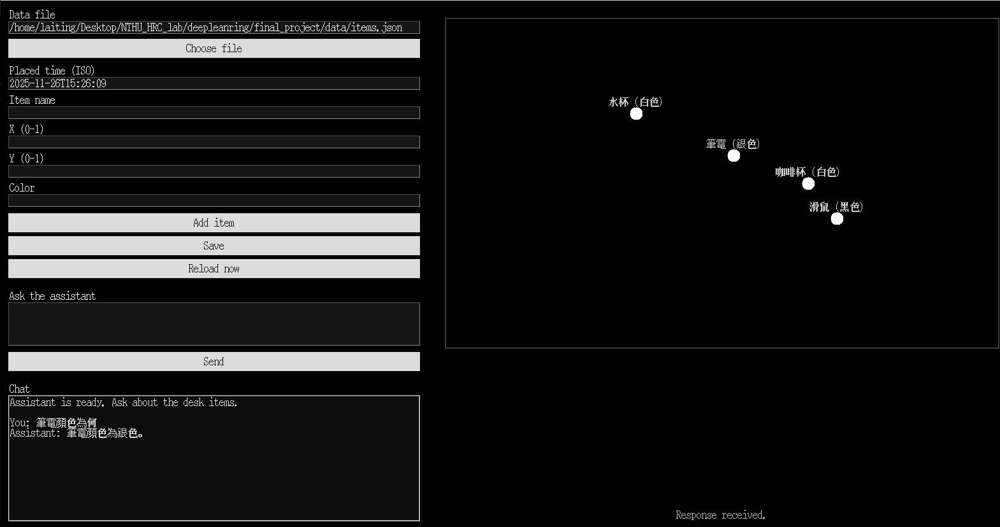

# DL-final-project

Desk items visualizer with OpenAI chat helper.

## Features
- Black-canvas desk map with white dots and labels for each item (name/color) at normalized (x, y) positions.
- Left panel to add/edit items and save to a JSON file (`data/items.json` by default).
- Auto-reload: watches the JSON file every second and refreshes the canvas when it changes.
- Simple chat: type a question and hit **Send**; the assistant answers using the latest desk items context.
- Reads OpenAI API key from `apu_key.txt` (same folder) or `OPENAI_API_KEY` env var.

## Requirements
- Python 3.10+ recommended.
- `pip install openai`.
- An OpenAI API key with quota. Place it in `apu_key.txt` (one line) or export `OPENAI_API_KEY`.

## Run
```bash
python desk_viewer.py
```
Click the canvas to fill normalized coordinates, add items, or edit `data/items.json` directly—changes appear automatically.

## UI preview


## Data format (`items.json`)
```json
[
  {
    "timestamp": "2024-11-26T13:00:00",
    "name": "Laptop",
    "x": 0.52,
    "y": 0.42,
    "color": "Silver"
  }
]
```
Coordinates are 0–1 with origin at the top-left of the desk.

## Notes
- `.gitignore` excludes `apu_key.txt` so your key is not committed.
- If the OpenAI call returns a quota error, supply a key with available usage.
